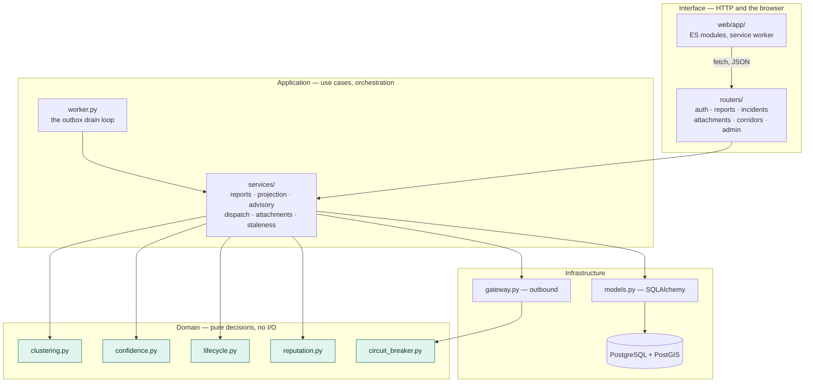
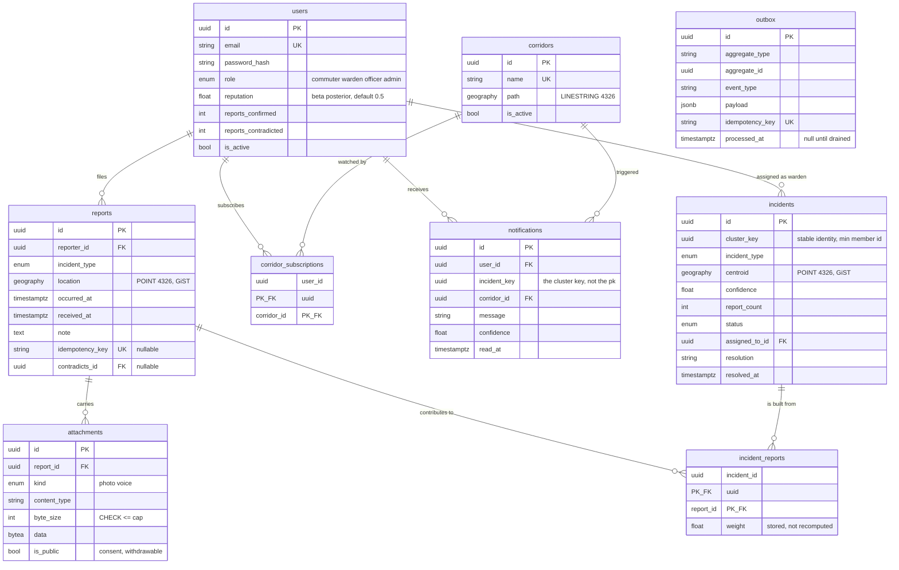
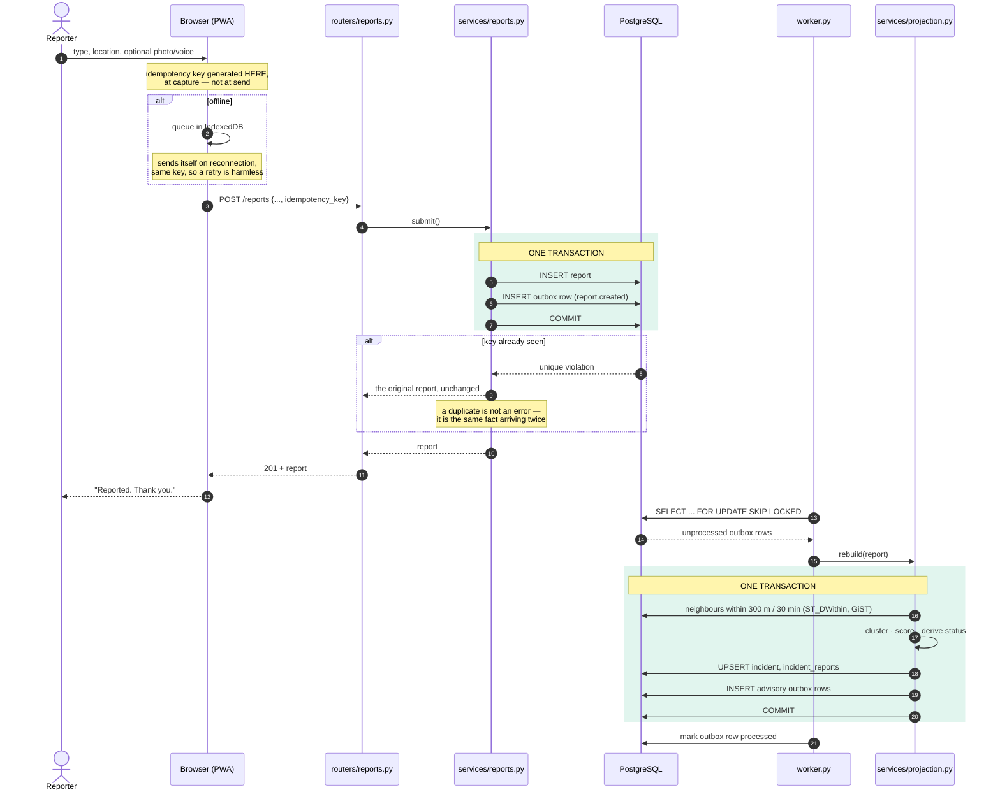
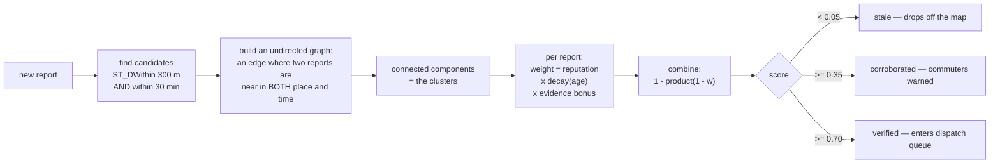
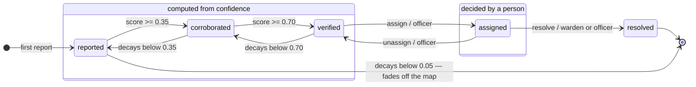
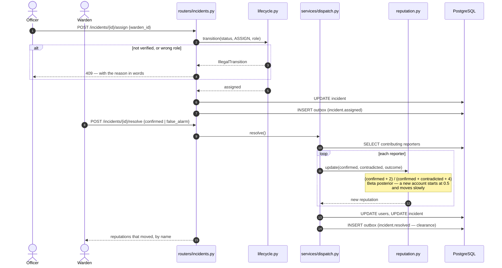
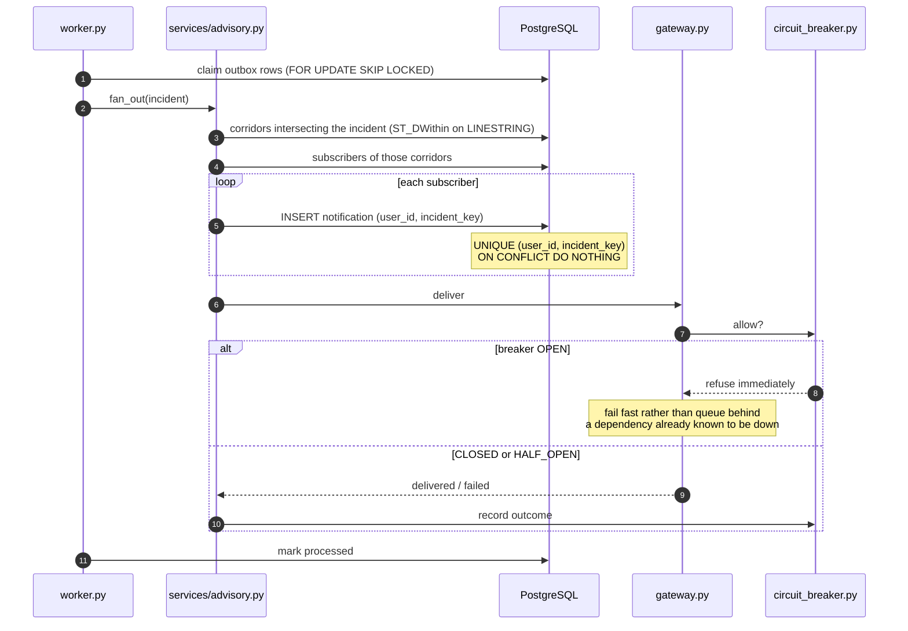
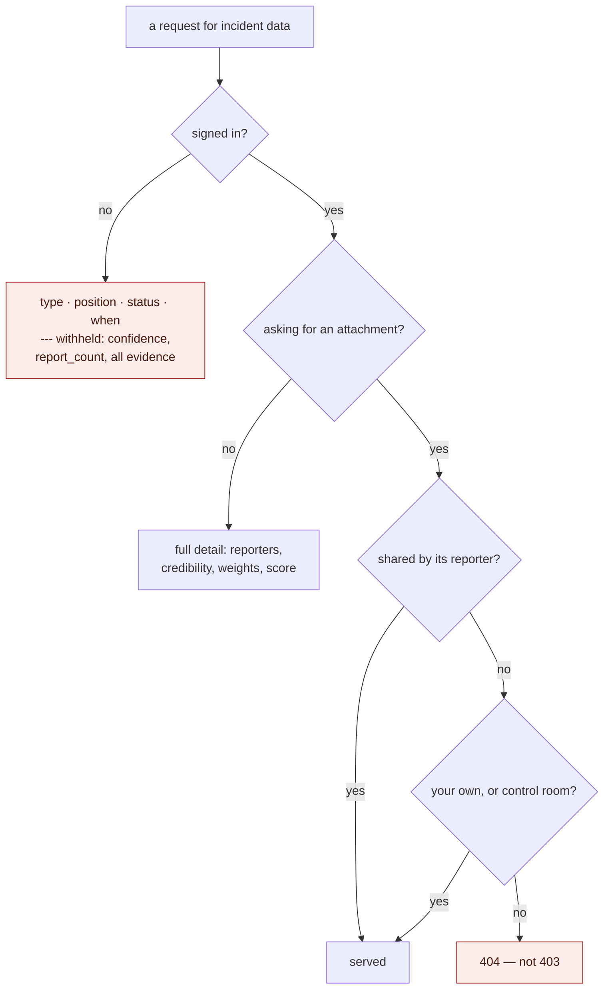
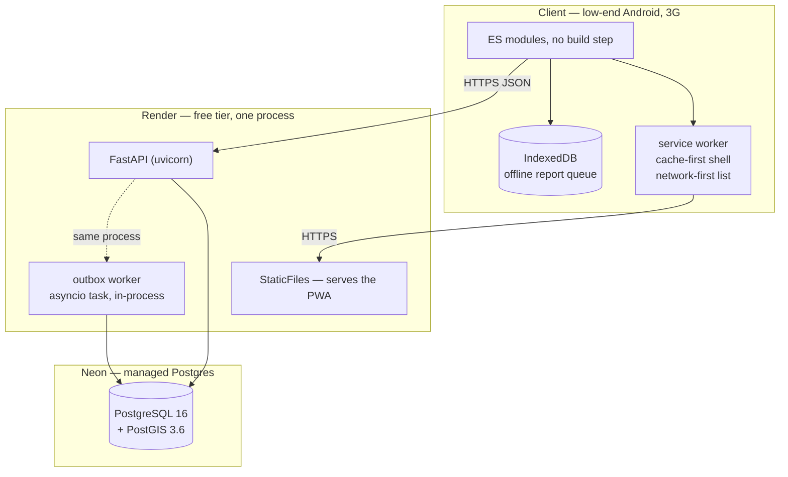

# System Analysis and Design

*Last updated: 14 August 2026*

This document describes how Nkwanta is put together and why it is put together that way.
It is the bridge between `02-problem-and-scope.md`, which says what the system must do,
and the code, which does it.

Every diagram here is generated from the actual module and table names. If a diagram and
the code disagree, the diagram is wrong and should be corrected — not the other way round.

**How to read this.** Each section states the idea in ordinary words first, then names the
technical term. Terms are defined in `03-glossary.md`. Decisions referenced as **D-0nn**
are in `05-decision-log.md`; compromises referenced as **TD-nn** are in
`08-technical-debt.md`.

---

## 1. The shape of the problem, and what that forces

Before any structure, the two facts about this problem that determine everything else.

**Reports arrive in an order nobody controls.** Six people on the same stretch of road all
report the same flood. Their phones have different signal, so the reports arrive seconds or
minutes apart, in any order, and some arrive twice because a phone retried. The system has
to turn that into one incident, and it has to reach the same incident whichever order they
landed in.

**A warning that is not sent is worse than no system.** The entire value of the application
is that somebody heading for that road finds out. So "the report was saved" and "the
warnings were queued" must not be able to come apart.

Those two facts produce most of the design:

| The fact | What it forces | Where it lives |
|---|---|---|
| Order is uncontrolled | Grouping must be order-independent, and provable | `app/clustering.py`, `tests/test_clustering_properties.py` |
| Reports duplicate | Every write carries a key that makes a retry harmless | `Report.idempotency_key`, `Notification.incident_key` |
| A warning must not be lost | Save and enqueue in one transaction | `app/services/reports.py` + `outbox` table |
| Evidence must be auditable | Reports are written once and never edited | `Report` has no status column |
| The score decides police involvement | It must be explainable, not merely displayed | `IncidentReport.weight` is stored, not recomputed |

---

## 2. Architectural style

**Layered, with a pure core.** Four layers, and one rule about which may call which.

**The rule: the domain layer imports nothing from the layers above it, and touches no
database, clock or network.** Every function in it is given what it needs and returns a
value. `clustering.group()` takes a list of report positions and times and returns
groupings. `confidence.score()` takes weights and returns a number. `lifecycle.transition()`
takes a status, an action and a role, and returns the next status or refuses.

This is not decoration. It is the reason the property-based tests are possible at all:
Hypothesis can call `group()` ten thousand times with generated inputs because calling it
costs nothing and touches nothing. A clustering function that read from the database
could not be tested that way, and the order-independence property — the centre of this
project — could not be proved. See D-035 for the companion rule about time.

**Why not hexagonal or clean architecture in full.** Both would add ports and adapters
around a domain that has exactly one persistence mechanism and one delivery mechanism. The
indirection buys substitutability nobody has asked for. The one rule above delivers the
benefit that mattered — a testable core — at a fraction of the ceremony. Recorded as a
deliberate omission rather than an oversight.

---

## 3. The data model

Two things about this diagram are the design, rather than incidental.

**`reports` is append-only.** It has no `status`, no `is_deleted`, no `resolved` column.
Nothing about a report changes after it is written. A report that turns out to be wrong is
not edited — the incident it belongs to is resolved as a false alarm, and the reporter's
reputation moves. The evidence of what somebody actually said survives intact.

**`incidents` is derived.** It is a summary the system recalculates from the reports —
a *projection*. It could be dropped entirely and rebuilt by replaying `reports`, and
`scripts/` can do exactly that. That is what makes it safe to change the clustering rules
later: the history is the reports, not the map.

### Three columns worth explaining on their own

**`incidents.cluster_key`.** An incident's primary key is not a stable name for it. When
two clusters merge because a new report bridges them, one row survives and the other does
not — so a key that meant "this incident" yesterday may not exist today. `cluster_key` is
the smallest report id in the cluster, which is stable under merging because the smallest
member of a union is the smaller of the two smallest. Notifications are keyed by it, so a
merge cannot cause the same person to be warned twice about what is now one incident.

**`incident_reports.weight`.** The contribution each report made, stored at the moment it
was computed. It could be recomputed on demand — but then the number shown to an officer
would change every time they refreshed, because it decays with time. Storing it makes the
confidence score *explainable*: an officer can see which reporter contributed what. A
number an officer cannot interrogate is a number they learn to ignore.

**`outbox.idempotency_key`.** Unique. The worker may deliver the same message twice — that
is the honest guarantee of any retrying system — so the key makes the second delivery a
no-op rather than a second warning.

---

## 4. The critical path: a report arrives

This is the sequence that carries the project's advanced concept. Read the two boxes
marked **one transaction** — everything else follows from them.

**Why the outbox row is written in the same transaction as the report.** The obvious
alternative is: save the report, then send the notifications. If the process dies in the
gap — and free-tier hosting restarts processes routinely — the report exists and nobody is
ever warned. Silently. The database cannot save one of two rows in one transaction, so
either both are there or neither is, and a crash leaves work to be picked up rather than a
warning that was never sent. This is the *transactional outbox* pattern.

**Why the key is generated in the browser.** If the server generated it, a retry after a
timeout would be a different request and would create a second report. Generated at
capture, the same physical report carries the same key however many times it is attempted
— which is what makes the offline queue safe rather than merely convenient.

---

## 5. Grouping and scoring — the order-independent part

**Why connected components rather than a clustering algorithm.** k-means needs to be told
how many clusters there are. DBSCAN is sensitive to the order points are visited when
density is borderline. Connected components on a symmetric "is near" relation has the
property this problem actually requires: **the components of a graph do not depend on the
order the edges were added.** The order-independence is a consequence of the data
structure, not something the code has to be careful about — which is a much stronger
guarantee than care.

**Why noisy-OR for combining.** `1 − ∏(1 − wᵢ)` treats each report as independent evidence.
It is monotonic — another report can never lower the score — bounded below 1 no matter how
many reports arrive, and, critically, **commutative and associative**, so combining in a
different order gives the same answer. A mean would not be monotonic; a sum would not be
bounded.

**How the property is proved rather than asserted.** `tests/test_clustering_properties.py`
generates report sets with Hypothesis, shuffles them, groups both orders, and asserts the
results are identical. It also carries a meta-test asserting the generator actually
produces merges — an earlier version passed vacuously because uniformly random points
almost never landed within 300 m of each other (D-022). Hypothesis found a real defect
this way: three identical longitudes produced a mean one unit in the last place below the
minimum, because floating-point addition is not associative (D-027).

---

## 6. The incident lifecycle

Two kinds of state, and the distinction matters.

**Computed states** are a function of the score. Nobody sets them; they follow from the
arithmetic and they can move in either direction as reports arrive and decay.
**Decided states** are the result of a person acting, and the score cannot override them —
an incident a warden has been sent to does not quietly revert because confidence dipped.

The whole machine is the `RULES` table in `app/lifecycle.py`; anything not listed there is
impossible. Two refusals are worth stating because they are policy, not validation:

- **An incident can only be assigned from `verified`.** An officer should not be
  dispatching a warden to something the system does not yet believe. If it matters and
  confidence is low, the answer is more corroboration, not a lower bar.
- **An incident can only be resolved from `assigned`.** It cannot be closed by someone who
  never sent anyone to look, or the queue could be cleared by wishful thinking.

The interface is driven by this table rather than duplicating it: `GET /incidents/{id}`
returns `allowed_actions`, and a button that would be refused is never drawn. One source of
truth for what is possible, in the layer that can enforce it.

---

## 7. The feedback loop that makes the score mean anything

Reputation is what stops the system being a megaphone for whoever shouts loudest. It is
what a warden found, fed back to the people who reported it.

**Why a Beta posterior rather than a running average.** The two pseudo-counts mean a brand
new account starts at 0.5 and cannot reach 0.9 on a handful of lucky reports — it takes
around eighteen confirmations. It is deliberately slow to build, which makes it expensive
to fake, and it degrades gracefully: someone with one confirmed report is not treated as
perfectly reliable.

**Why resolution moves reputation in both directions.** If confirmation only ever raised
it, a fabricated report would cost its author nothing. The false-alarm path is what gives
the number teeth.

---

## 8. Delivery: one warning per person, exactly once

**`FOR UPDATE SKIP LOCKED`** lets more than one worker drain the same table without two of
them claiming the same row — the second skips what the first has locked instead of waiting
for it. Today there is one worker (TD-01), but the query does not have to change when there
are more.

**The unique constraint is the idempotency.** The worker's guarantee is *at least once* —
it may retry a message it already delivered. `UNIQUE (user_id, incident_key)` with
`ON CONFLICT DO NOTHING` turns that into *effectively once* at the only place it matters:
what the person actually sees. Keyed on `incident_key` rather than the incident's primary
key, so two incidents merging cannot re-warn someone.

**The circuit breaker** stops a failing outbound dependency from consuming the worker. After
a threshold of failures it opens and refuses immediately for a cooling period, then admits
one trial call. Its clock is injected (D-035), so the tests drive it through all three
states in microseconds rather than sleeping.

---

## 9. The privacy boundary

Three rules, each traceable to a requirement, and all three enforced in the API rather than
the interface — a gate the client draws is a gate anybody opens with `curl`.

| Rule | Requirement | Where |
|---|---|---|
| A signed-out visitor sees the road, not the people | NFR-4a, D-044 | `routers/incidents.py` — evidence rows dropped before the attachment query runs |
| A recording is private unless its reporter shares it | NFR-4a, D-029 | `services/attachments.py::may_play` |
| A refusal is a 404, never a 403 | NFR-4 | `routers/attachments.py` |

**Why 404 rather than 403.** A 403 confirms the thing exists. For an attachment on someone
else's report, the existence *is* the private fact — it says that person recorded
something about that incident. The status code has to lie about the resource to tell the
truth about the policy.

**The signed-URL problem.** `` and `<audio>` cannot send an `Authorization` header —
the browser issues those requests itself. So private attachments were, in practice,
unviewable by everyone including their own uploader. The API mints a short-lived signed
token into the URL for callers it has already cleared (D-043), which is the mechanism
behind an S3 presigned URL and for the same reason: check the entitlement once where the
caller is known, then carry it to a place where they are not.

---

## 10. Deployment

**The worker runs inside the API process, and that is a compromise.** Render's free tier
allows one service, so a separate worker is not available. It means the worker competes
with request handling for the event loop, and cannot be scaled independently. Recorded as
**TD-01** with its cause, impact and the fix — extracting it is a configuration change, not
a rewrite, because it already communicates only through the `outbox` table. That is the
point of the pattern: the deployment topology is not baked into the design.

**No build step for the front end** (D-037). Native ES modules served directly. On a
48-hour clock a build pipeline is a thing that can break at hour 44 for reasons unrelated
to the product, and the loss — no bundling, no minification, no JSX — is measured against
a codebase of thirteen small modules.

---

## 11. Traceability

Design elements to the requirement that caused them and the test that holds them.

| Design element | Requirement | Test |
|---|---|---|
| Transactional outbox | NFR-1 — warnings within 10 s of verification | `test_integration_pipeline.py`, `test_worker.py` |
| Order-independent clustering | The advanced concept | `test_clustering_properties.py` (Hypothesis) |
| Bounded, monotonic confidence | Explainable escalation | `test_confidence_properties.py` (Hypothesis) |
| Idempotency key at capture | Offline-first on 3G — NFR-2 | `test_report_intake.py`, `test_pwa.py` |
| `UNIQUE (user_id, incident_key)` | Nobody warned twice | `test_advisory.py` |
| Lifecycle `RULES` table | NFR-5 — no claim of dispatching emergency services | `test_lifecycle.py` |
| Voice private by default | NFR-4a | `test_attachments.py` |
| Signed-out gate | NFR-4a, D-044 | `test_public_map.py` |
| Circuit breaker, injected clock | Resilience; D-035 | `test_circuit_breaker.py` |
| Read-only driver view, voice reporting | NFR-3 | `test_pwa.py` |

---

## 12. Where the design is knowingly imperfect

Every one of these is in `08-technical-debt.md` with a cause, an impact, a priority and a
proposed fix. They are listed here so that a reader of the design does not have to discover
them by reading the code.

| Compromise | Consequence | Register |
|---|---|---|
| Worker in-process | Cannot scale independently; competes with requests | TD-01 |
| No event snapshotting | A full rebuild replays every report | TD-02 |
| Clustering constants hardcoded | 300 m / 30 min are untuned guesses | TD-03 |
| Attachment bytes in PostgreSQL | The first thing to fail under adoption | TD-19 |
| Confidence decays only when a sweep runs | A stored score can be briefly stale | TD-22 |
| One database shared by local and deployed | A local test can disturb live demo data | TD-18 |

The clustering constants deserve the emphasis. **300 metres and 30 minutes are the two
most important numbers in the system** — they decide whether six reports are one flood or
six — and they were chosen by reasoning about Accra's road spacing, not by measurement
against real data, because no such data exists yet. The system is built so that changing
them is safe: the reports are the history, the incidents are derived, and a rebuild
reproduces the map under new parameters.

---

## 13. Summary for the viva

- **Layered with a pure domain core.** The core touches no database, clock or network,
  which is what makes ten thousand generated test cases affordable.
- **Reports are permanent; incidents are calculated.** The map can be rebuilt from
  history, so the grouping rules can change without losing evidence.
- **Order-independence is structural.** Connected components and noisy-OR are commutative
  by construction, not by careful coding — and Hypothesis proves it rather than the
  documentation asserting it.
- **Save and notify cannot come apart.** One transaction, then a worker that may retry, and
  a unique key that makes a retry harmless.
- **Every refusal is policy in the API.** The lifecycle table, the privacy boundary and the
  signed-out gate are all enforced server-side; the interface reads them rather than
  reimplementing them.
